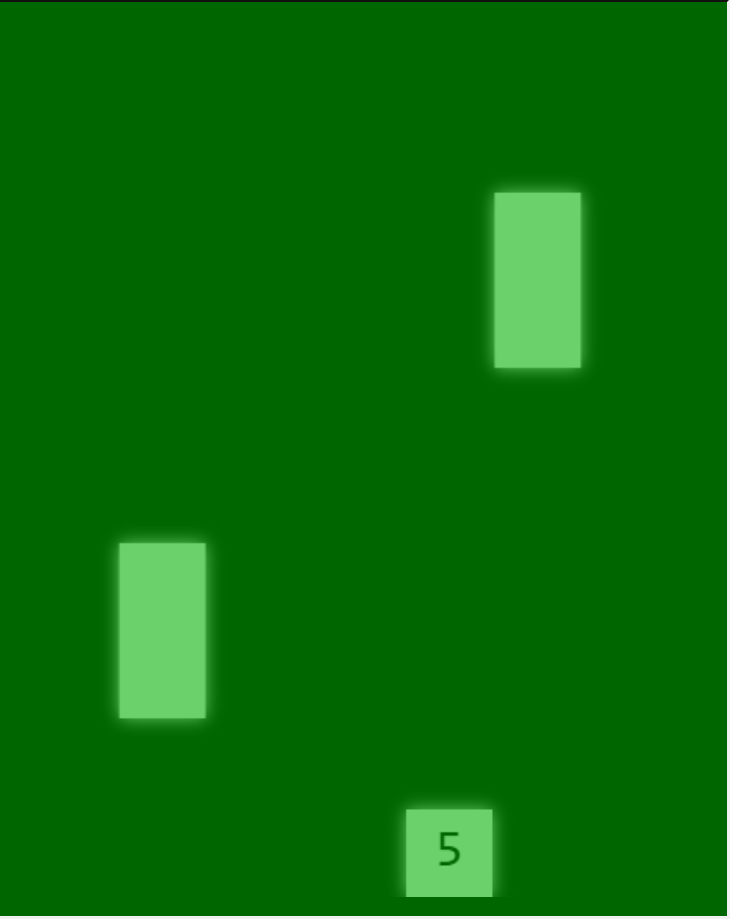

# Übung 4 - Canvas #

Starter Code:
* **[FallingStones.js](./src/js/games/FallingStones.js)**

GameEngine usw:
* **[GameEngine.js](./src/js/GameEngine.js)** (Kümmert sich um Eingaben und Spielauswahl)
* **[GameTemplate.js](./src/js/games/GameTemplate.js)** (Parent Klasse für alle Games)
* **[GameObject.js](./src/js/GameObject.js)** (nützliche Objekte)

Andere Spiele in der GameBox: 
* **[TestGame](./src/js/games/TestGame.js)**
* **[Pong](./src/js/games/Pong.js)**
* **[Snake](./src/js/games/Snake.js)**

## 00 Vorbereitung ##

* Wechselt zum `master` Branch und erstellt einen neuen Branch für die heutige Übung. z.B. `Ü4-bearbeitung`

## 01 Code Verständnis ##

Lest den Code von **[TestGame](./src/js/games/TestGame.js)**, **[Pong](./src/js/games/Pong.js)** und **[Snake](./src/js/games/Snake.js)** an und schaut euch an wie die Spiele **[GameTemplate](./src/js/games/GameTemplate.js)** erweitern und wie sie **[Game Objekte](./src/js/GameObject.js)** hernehmen.

Stellt euch diese Fragen: 
* Was unterscheidet den Programmablauf von Pong grundsätzlich von Snake?
* Warum ist für `Snake` und `Pong` kein Konstruktor definiert?
* Warum benutzt Snake keine Kollisionsabfragen?
* Warum macht es Sinn auf `keydown` bzw `keyup` events zu reagieren anstatt `keypress`?
* Wo wird eigentlich `this.maxBallSpeed` in Pong gesetzt?
* Warum brauchen wir `this.maxBallSpeed` überhaupt?
* Warum können wir durch drücken der `primary` Aktion (Tastenbelegung in [Inputs.js](./src/js/Inputs.js)) ein Spiel neu starten?
* Wie erhöht man die Geschwindigkeit der Schlange in Snake?
* Warum müssen `update` und `draw` Aufrufe den Canvaskontext `ctx` erhalten?

## 02 Falling Stones ##

Eure heutige Aufgabe ist es das Spiel **[FallingStones](./src/js/games/FallingStones.js)** zu implementieren.

Das Spiel beinhaltet Drei Objekttypen:
* Der Spieler: ein 50x50 großer Block der sich am unteren Bildrand hin und her bewegen kann
* Die Steine: 50x100 große Blöcke dir vom oberen Rand des Spielfelds zum unteren fallen
* Projektile: 10x10 große Blöcke mit denen der Spieler auf die Steine schießen kann, diese fliegen von unten nach oben

Spielregeln:
* Wenn ein Stein das Spielfeld am unteren Rand verlässt verliert der Spieler ein Leben
* Wenn ein Projektil einen Stein trifft werden beide zerstört
* Objekte die das Spielfeld verlassen sollen entfernt werden um Resourcen zu sparen

Denkanstöße:
* müssen alle Steine überprüfen ob sie das Spielfeld verlassen haben?
* Müssen alle  Projektile überprüfen ob sie gerade Steine treffen?

### 02.1 Geerbte Funktionen ###

Jede Klasse die von gameTemplate **[GameTemplate](./src/js/games/GameTemplate.js)** erbt, hat damit auch alle Methoden die in **[GameTemplate](./src/js/games/GameTemplate.js)** definiert sind.
Einige dieser Funktionen benutzen wir ohne Veränderung, andere müssen wir in **[FallingStones.js](./src/js/games/FallingStones.js)** überschreiben.

Erstelle die Funktionen
* `start()` (setzt darin `this.gameOver=false`)
* `bindControls()` 
* `update(ctx)`
* `draw(ctx)`

und den statische Getter 
* `NAME` (auch return Wert definieren)

erstelle in `bindControls` das Objekt `this.inputBinding = {}`

### 02.2 Der Spieler ###

Erstelle in `start()` ein Spielerobjekt, wähle und importiere hierfür ein passendes Objekt aus **[GameObject.js](./src/js/GameObject.js)** oder einem anderen Spiel. **Es ist keine Erweiterung dieses Objekts nötig wenn ihr korrekt wählt**
Das Spielerobjekt ist am unteren Rand zentral auf dem Bildschirm positioniert.

Zeichne in `draw` den Spieler um das Objekt auf dem Canvas anzuzeigen. (`this.player.draw(ctx)`)

### 02.3 Da passiert was ###

Der Spieler soll sich auch bewegen können.

Verknüpfe durch Einträge in `this.inputBinding` Eingaben mit den Bewegungen des Spielerobjekts.

Aktualisiere in `update` den Zustand des Spielers um Bewegung zu ermöglichen. (`this.player.update(ctx)`)

### 02.4 pew pew pew ###

Füge in `start()` das Array `this.bullets` hinzu.
Füge eine Funktion hinzu die ein Projektil an der Position des Spielers erzeugt und dies in `this.bullets` speichert. Auch für Projektile könnt ihr vorhandene Klassen verwenden.
Füge einen Eintrag in `this.inputBinding` hinzu der eine Taste mit dieser Funktion verknüpft.

Füge eine Funktion hinzu die von `update` aufgerufen wird.
Funktionalitäten:
* updated alle vorhandenen Projektile
* überprüft ob Projektile das Spielfeld verlassen haben und entfernt sie aus `this.bullets`

### 02.5 Solange uns nicht der Himmel auf den Kopf fällt ###

Füge in `start()` das Array `this.stones` hinzu.
Füge eine Funktion hinzu die von `update` aufgerufen wird.
Funktionalitäten:
* updated alle vorhandenen Steine
* überprüft ob Steine das Spielfeld verlassen haben und entfernt sie aus `this.stones`
* Erstellt in regelmäßigen Abständen am oberen Rand an zufälligen x-Koordinaten neue Steine (`Math.random()`)

### 02.6 pew pew pew? ###

Erweitere die Funktion, die die Projektile aktualisiert
Funktionalität:
* Wenn ein Projektil einen Stein trifft, werden beide zerstört
* Verhindere Dauerfeuer, ein Schuss soll eine bestimmte Zeit nach dem letzten Schuss nicht möglich sein

### 02.7 High Score! ###

Erstelle in `start()` die Variablen `this.points` und `this.life`

Erweitere deine bestehenden Funktionen:
* Der Aktuelle Wert von `this.life` wird an der Position des Spielerobjekts angezeigt (`ctx.fillText(...)` verwenden)
* Ein Stein der erfolgreich das Spielfeld verlässt zieht eine Leben ab
* Ein Stein der erfolgreich zerstört wird gibt eine Punkt
* Wenn das Leben auf `0` sinkt setzt `this.gameOver=true` und erweitert den `this.gameOverText` um eine Eintrag der die erreichten Punkte zeigt

### 02.8 (BONUS) Schwierigkeiten ###

Definiere drei Schwierigkeiten für **[FallingStones](./src/js/games/FallingStones.js)** die die Initialwerte des Spiels sinnvoll anpassen um es leichter oder schwieriger zu machen.
(vgl. **[Pong](./src/js/games/Pong.js)**)

### 02.9 (BONUS) *Difficulty intesifies*

Erweitere das Spiel damit es zunehmend schwieriger wird wenn der Spieler mehr Punkte erreicht.

## 03 Projekt ##

Macht euch Gedanken was ihr im Projekt machen wollt.
Schreibt Ideen auf und sprecht mich darauf an.

